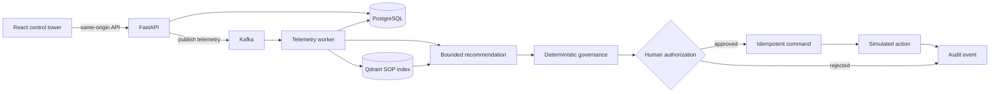

# ColdChain Sentinel

ColdChain Sentinel is a governed AI control tower for temperature-sensitive logistics. It converts telemetry into evidence-backed operational recommendations while deterministic policy and accountable human reviewers retain decision authority.

The repository demonstrates a complete local workflow: Kafka telemetry ingestion, deterministic breach detection, immutable evidence, versioned SOP retrieval, bounded AI recommendations, policy enforcement, human approval, idempotent commands, simulated execution, and an append-only audit trail.

> ColdChain Sentinel is a portfolio-scale engineering system built with synthetic data. It is not deployed, does not control real shipments, and does not provide medical, regulatory, or logistics authorization.

## Demonstration

> A narrated end-to-end demonstration will be added after the final recording. The repository already includes a deterministic local demo workflow and a complete recording guide.

- [Demo recording script](docs/portfolio/demo-recording-script.md)
- [Screenshot plan](docs/portfolio/screenshot-plan.md)

<!-- Replace this comment with the final linked video thumbnail after recording and privacy review. -->

## Problem

A temperature alert does not by itself establish what happened, which operating procedure applies, whether a proposed response is permitted, or who authorized the resulting action. An operational system must preserve evidence, apply policy independently of probabilistic model output, prevent duplicate execution, and explain the complete decision later.

ColdChain Sentinel treats AI as one bounded input to that process rather than as the system of authority.

## System behavior

For a sustained synthetic temperature excursion, the platform:

1. accepts versioned telemetry through FastAPI and publishes it to Kafka;
2. evaluates a deterministic temperature policy in the worker;
3. persists telemetry, an incident, and an immutable evidence snapshot in PostgreSQL;
4. retrieves effective ColdChain Sentinel SOP chunks from Qdrant;
5. produces a bounded recommendation through the deterministic provider or an explicitly enabled external provider;
6. validates schema, action, evidence, citations, expiry, and provenance;
7. applies deterministic governance, including kill-switch precedence;
8. requires an authorized human decision for `HOLD_SHIPMENT`;
9. creates one idempotent command after approval;
10. records a simulated action result and hash-linked audit events.

## Why governed AI

An ordinary chatbot can generate plausible text but cannot safely own operational authority. ColdChain Sentinel separates four responsibilities:

- **Recommendation:** an advisory proposal grounded in incident evidence and retrieved SOP identifiers.
- **Governance decision:** a deterministic policy result that can allow, block, or require approval.
- **Human authorization:** an accountable, role-checked decision with rationale and expiry enforcement.
- **Command:** an idempotent instruction created only after every preceding control succeeds.

The provider can return only eight decision fields. Trusted application code owns provider identity, prompt and schema versions, timestamps, expiry, correlation, billing mode, validation state, and provenance. Invalid output or provider failure selects deterministic fallback; it never bypasses governance.

## End-to-end workflow

```text
Telemetry and evidence
  -> advisory recommendation
  -> deterministic governance
  -> human authorization
  -> idempotent command
  -> simulated action and audit event
```

Every transition is observable and testable. The language model cannot approve a recommendation, create a command, or invoke the action adapter.

## Architecture



FastAPI and the worker are separate process entry points within a modular monolith. PostgreSQL is the authoritative workflow store, Kafka carries telemetry events, and Qdrant supplies versioned SOP evidence. Prometheus metrics, structured logs, and OpenTelemetry traces observe the boundaries without persisting prompts, credentials, SOP text, or incident payloads.

See the [authoritative architecture](docs/architecture/target-architecture.md) for component responsibilities, trust boundaries, and failure behavior.

## Decision authority model

| Boundary | Produces | Authority |
|---|---|---|
| Evidence and retrieval | Incident facts and applicable SOP chunks | Trusted inputs, not a decision |
| Recommendation provider | Bounded proposed action and rationale | Advisory only |
| Deterministic governance | Allowed, blocked, or approval-required result | Authoritative policy |
| Human reviewer | Approval or rejection with rationale | Consequential authorization |
| Command adapter | Idempotent simulated result | Executes only an authorized command |

`HOLD_SHIPMENT` always requires human approval. An active governance kill switch prevents command creation regardless of model output.

## Key capabilities

- Manual-commit Kafka processing with dead-letter handling.
- Deterministic breach policy and duplicate/stale telemetry handling.
- Transactional PostgreSQL workflow state and append-only, hash-linked audit history.
- Versioned SOP ingestion and effective-date retrieval through Qdrant.
- Strict provider JSON Schema, citation allowlists, bounded requests, and safe error metadata.
- Deterministic fallback, circuit breaking, expiry enforcement, and provider-neutral configuration.
- Role-checked approval, self-approval prevention, and idempotency conflict detection.
- React control tower with runtime-validated API responses and explicit unavailable states.
- Prometheus/Grafana metrics and OpenTelemetry/Jaeger tracing with privacy controls.
- Deterministic offline evaluation covering 16 governance and safety scenarios.

## Technology stack

| Area | Technologies |
|---|---|
| Frontend | React 19, TypeScript 6, Vite, TanStack Query, Zod, Recharts, Vitest, Testing Library, jest-axe |
| Backend | Python 3.12, FastAPI, Pydantic, async SQLAlchemy, Alembic, httpx, uv |
| Data and messaging | PostgreSQL 16, Kafka 3.9 in KRaft mode, Qdrant 1.19 |
| AI and retrieval | Deterministic provider, OpenAI-compatible provider boundary, optional Groq/OpenAI, deterministic embeddings |
| Governance | Closed action types, versioned policy, expiry, kill switch, human approval, idempotency |
| Observability | Prometheus, Grafana, OpenTelemetry, Jaeger, correlated structured logs |

Redis is intentionally absent. PostgreSQL owns durable state and idempotency, while Kafka owns event delivery; the demonstrated workload does not justify another state system.

## Control-tower interface

| Route | Purpose |
|---|---|
| `/` | Command Center overview and service posture |
| `/incidents` | Incident queue, filtering, and prioritization |
| `/investigation/:incidentId` | Evidence, recommendation, governance, approval, command, and audit timeline |
| `/governed-ai` | Recommendation lifecycle and authority boundaries |
| `/observability` | Local metrics, dashboards, alerts, and trace links |
| `/demo-lab` | Synthetic scenarios executed through the Kafka-backed workflow |

The frontend supports a clearly identified browser-local fixture mode for interface review and an API mode for the integrated demonstration. API mode does not silently substitute fixture data when the backend is unavailable.

## Local quick start

### Requirements

- Windows PowerShell
- Python 3.12
- [uv](https://docs.astral.sh/uv/)
- Node.js and npm
- Docker Desktop with Docker Compose

```powershell
git clone https://github.com/sa-rehman1/coldchain-sentinel.git
cd coldchain-sentinel
Copy-Item .env.example .env
uv sync --locked --all-groups
cd frontend
npm ci
cd ..
```

The copied `.env` contains local-only placeholders. It is ignored by Git and must never contain production credentials.

## Configuration and provider modes

| Mode | Configuration | Network behavior |
|---|---|---|
| Deterministic | `LLM_PROVIDER=deterministic` and `LLM_LIVE_CALLS_ENABLED=false` | No external model request; no embedding download |
| Groq | Explicit `-EnableGroq` launcher switch plus a server-side key in ignored `.env` | Optional external request path |
| OpenAI | Provider configuration supported and offline-tested | Disabled by the launcher and never enabled automatically |

Provider credentials remain server-side. The browser receives only bounded application responses and never receives an API key or authorization header.

## Deterministic demonstration

The supported zero-cost path starts the API, worker, frontend, PostgreSQL, Kafka, and Qdrant; applies migrations; ingests the SOP corpus; and waits for health checks:

```powershell
.\scripts\demo.ps1 -Action Start -Observability
```

If another PostgreSQL instance owns host port 5432, change only the host binding:

```powershell
.\scripts\demo.ps1 -Action Start -Observability -PostgresHostPort 15432
```

Open `http://127.0.0.1:4173`, select **Dispatcher**, open **Demo Lab**, and run **Sustained temperature breach**. Follow the created incident through evidence, recommendation, governance, approval, command, simulated action, and audit history.

Stop services without deleting containers, volumes, or data:

```powershell
.\scripts\demo.ps1 -Action Stop -Observability
```

## Optional Groq demonstration

Store `GROQ_API_KEY` only in the ignored `.env`, review the provider account limits, and opt in explicitly:

```powershell
.\scripts\demo.ps1 -Action Start -EnableGroq
```

The launcher does not print the key. External output remains advisory and is subject to the same local validation, governance, approval, command, and audit boundaries. The deterministic workflow remains the recommended recording path.

## Testing and evaluation

Current development-validation results:

- **109** non-live backend tests passed with **87.09%** branch coverage.
- **115** tests passed in the containerized PostgreSQL/Qdrant suite, with 3 explicitly gated tests skipped.
- **50** frontend component and accessibility tests passed.
- **16/16** deterministic evaluation scenarios passed.
- Ruff, strict mypy, ESLint, strict TypeScript, prompt/schema drift, Alembic drift, packaging, Compose, environment, and credential checks passed.
- One controlled synthetic Groq request was validated during the provider milestone; no OpenAI live request has been made.

These are development checks, not production traffic, availability, or business-impact metrics.

```powershell
uv lock --check
uv run ruff format --check .
uv run ruff check .
uv run mypy
uv run pytest -m "not integration and not e2e and not live_groq and not live_openai"
uv run python scripts/run_evaluations.py

cd frontend
npm run lint
npm run typecheck
npm test -- --run
npm run build
```

## Security and trust boundaries

- External calls are disabled by default and require explicit process configuration.
- Provider keys are read from server-side environment variables and excluded from frontend assets.
- Recommendation output uses a strict schema and closed action set.
- SOP and incident citations must resolve to identifiers supplied in the current request context.
- Application code owns provenance, expiry, correlation, and provider metadata.
- Deterministic governance re-evaluates every recommendation and fails closed.
- Human identity, role, rationale, expiry, and idempotency are checked server-side.
- Metrics use bounded labels; logs and traces exclude sensitive request and response material.
- Command execution is simulated and cannot be triggered directly by a provider.

Threat and boundary details are documented in the [prompt-injection threat model](docs/security/prompt-injection-threat-model.md) and [observability trust boundaries](docs/security/observability-trust-boundaries.md).

## Observability

The optional `observability` Compose profile provides:

- Prometheus metrics for bounded workflow outcomes and latency;
- provisioned Grafana dashboards and alert rules;
- OpenTelemetry propagation across HTTP and Kafka;
- Jaeger trace inspection on localhost;
- correlated JSON logs with credential-shaped value redaction.

Observability services bind to localhost and do not receive prompts, unrestricted provider responses, SOP contents, authorization headers, or raw incident payloads.

## Repository structure

```text
src/coldchain/
  api/              FastAPI composition, routes, middleware, and transport schemas
  application/      workflow services and application-facing protocols
  domain/           framework-independent policy and workflow models
  infrastructure/   PostgreSQL and Kafka adapters
  ai/               provider contract, strict output models, and prompt assets
  retrieval/        SOP corpus loading, chunking, embeddings, and Qdrant access
  governance/       deterministic governance engine
  observability/    metrics, logging, and tracing boundaries
  workers/          Kafka telemetry worker entry point
frontend/            feature-oriented React control tower
tests/               unit, integration, live opt-in, and Docker E2E tests
contracts/           versioned JSON Schemas and examples
alembic/             immutable PostgreSQL migration history
sop/                 authored ColdChain Sentinel SOP corpus
evaluations/         deterministic scenarios and thresholds
observability/       Prometheus and Grafana configuration
scripts/             validation, ingestion, evaluation, and demo workflows
docs/                architecture, security, operations, and portfolio material
```

## Documentation

- [Authoritative architecture](docs/architecture/target-architecture.md)
- [Integrated demonstration guide](docs/demo/milestone-2b-walkthrough.md)
- [Evaluation methodology](docs/guides/evaluation-methodology.md)
- [Provider migration guide](docs/guides/provider-migration-groq-to-openai.md)
- [Demo recording script](docs/portfolio/demo-recording-script.md)
- [Technical article draft](docs/portfolio/blog-draft.md)
- [Interview and recruiter guide](docs/portfolio/interview-guide.md)
- [Resume and portfolio material](docs/portfolio/resume-and-portfolio.md)

Architecture decision records and milestone documents preserve historical context. This README and the target architecture document describe the current system.

## Current limitations

- All shipment, identity, and incident data is synthetic.
- The local identity adapter is not production authentication.
- Infrastructure is single-node and localhost-only.
- Deterministic embeddings prioritize reproducibility over semantic quality.
- The action adapter records a simulated result and contacts no carrier or warehouse.
- The audit chain is append-only in PostgreSQL but is not an external immutable ledger.
- No production load, availability, recovery, or regulatory claims are made.

## Production-hardening roadmap

A production deployment would require enterprise identity and RBAC, managed secrets, TLS and network policy, real telemetry and transportation-management integrations, transactional outbox/inbox delivery, formal data classification and retention, immutable audit storage, provider qualification and budgets, load and failure testing, SLOs, backups, high availability, disaster recovery, and deployment-specific regulatory validation.
