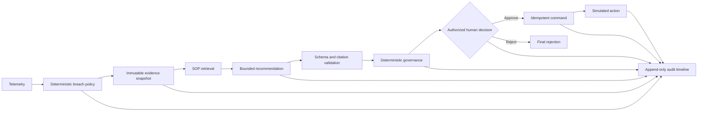
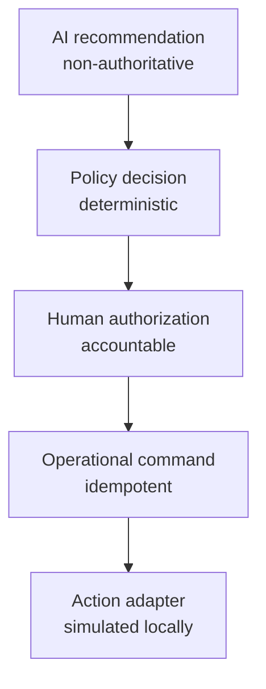
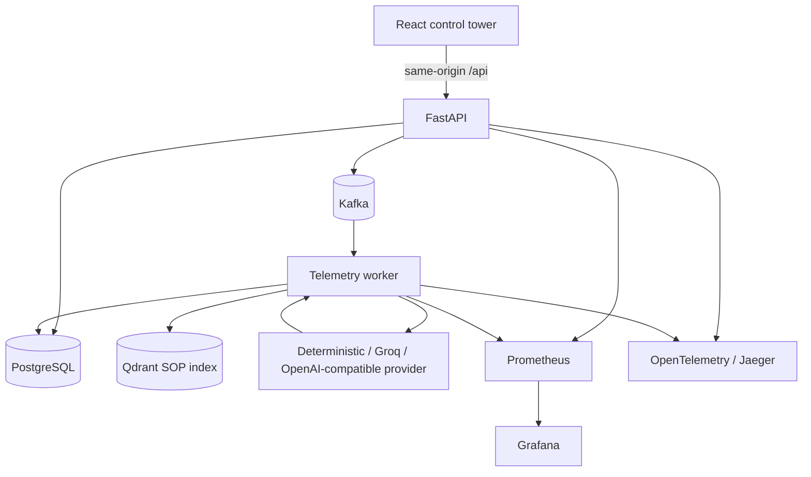

# ColdChain Sentinel

**A governed AI cold-chain control tower that turns temperature telemetry into evidence-backed recommendations while deterministic policy and authorized humans retain control.**

Temperature excursions can spoil sensitive cargo, but an alert alone does not answer the operational questions: Is the evidence trustworthy? Which procedure applies? Is the proposed action allowed? Who is accountable? ColdChain Sentinel demonstrates an end-to-end answer with synthetic local data, durable workflow state, trusted SOP retrieval, bounded AI advice, deterministic governance, human approval, and an auditable simulated action.

> This is a portfolio-scale local system, not a production deployment or a source of medical, regulatory, or logistics authorization.

## Why this is more than an AI chatbot

The model is an untrusted adviser behind a strict boundary. It can return only eight decision fields; it cannot set provenance, expiry, policy results, approvals, or commands. Application code validates the schema and citations, deterministic policy classifies the proposed action, and an authorized person makes the consequential decision. Provider failure safely selects deterministic fallback.

## Main capabilities

- Kafka-based synthetic telemetry ingestion and worker processing.
- Deterministic temperature-breach detection with immutable evidence snapshots.
- Versioned ColdChain Sentinel SOP retrieval from Qdrant.
- Provider-neutral recommendations: deterministic by default, optional Groq, and offline-tested OpenAI support.
- Strict output, allowed-action, evidence, citation, expiry, and provenance validation.
- Deterministic governance, kill-switch enforcement, and human approval.
- Idempotent command creation and simulated action execution.
- PostgreSQL incident state plus a hash-linked, append-only audit timeline.
- React control tower with API validation and no browser-held provider credentials.
- Prometheus metrics, redacted logs, OpenTelemetry traces, Grafana, and Jaeger.
- A deterministic 16-scenario evaluation harness.

## Governed decision workflow





## System architecture



See the [authoritative architecture](docs/architecture/target-architecture.md) for trust boundaries and failure behavior.

## Technology stack

| Area | Technologies |
|---|---|
| Frontend | React 19, TypeScript 6, Vite, TanStack Query, Zod, Recharts, Vitest, Testing Library, jest-axe |
| Backend | Python 3.12, FastAPI, Pydantic, SQLAlchemy async, Alembic, httpx, uv |
| Data | PostgreSQL 16, Kafka 3.9 KRaft, Qdrant 1.19 |
| AI / retrieval | Deterministic fallback, OpenAI-compatible boundary, Groq, optional OpenAI, deterministic embeddings |
| Governance | Closed action schemas, deterministic policy, expiry, kill switch, human approval, idempotency |
| Observability | Prometheus, Grafana, OpenTelemetry, Jaeger, correlated structured logs |

Redis is intentionally not used: PostgreSQL owns durable workflow state, Kafka owns event delivery, and the current local workload does not justify another state system.

## End-to-end breach scenario

1. Demo Lab publishes synthetic out-of-range readings to Kafka.
2. The worker applies the versioned breach policy and persists telemetry.
3. A durable incident and immutable evidence snapshot are created.
4. Effective SOP chunks are retrieved from Qdrant.
5. The deterministic provider—or an explicitly enabled external provider—creates advisory output.
6. Local schema, action, evidence, citation, expiry, and provenance checks run.
7. Deterministic governance requires approval for `HOLD_SHIPMENT`.
8. A dispatcher reviews the evidence and approves or rejects.
9. Approval creates one idempotent command and a simulated hold result.
10. The sequence appears in the audit timeline and observability views.

## Control-tower routes

| Route | Purpose |
|---|---|
| `/` | Command Center operational overview |
| `/incidents` | Incident queue and prioritization |
| `/investigation/:incidentId` | Evidence, recommendation, governance, approval, command, and audit trail |
| `/governed-ai` | Recommendation boundary and provider state |
| `/observability` | Local health, metrics, dashboards, and traces |
| `/demo-lab` | Synthetic scenarios through the Kafka-backed workflow |

## Local setup — Windows PowerShell

Requirements: Python 3.12, [uv](https://docs.astral.sh/uv/), Node.js/npm, Docker Desktop, and Docker Compose.

```powershell
git clone https://github.com/sa-rehman1/coldchain-sentinel.git
cd coldchain-sentinel
Copy-Item .env.example .env
uv sync --locked --all-groups
cd frontend
npm ci
cd ..
```

The copied `.env` contains local-only placeholders. Keep it ignored and never commit provider keys.

### Deterministic zero-cost demo

The safe default uses no external model and downloads no embedding model:

```powershell
.\scripts\demo.ps1 -Action Start -Observability
```

If another local PostgreSQL instance already owns port 5432, select an unused host port without
changing the internal Compose network: `.\scripts\demo.ps1 -Action Start -Observability -PostgresHostPort 15432`.

Open `http://127.0.0.1:4173`, choose **Dispatcher**, open **Demo Lab**, and run **Sustained temperature breach**. Stop services without deleting containers or volumes:

```powershell
.\scripts\demo.ps1 -Action Stop -Observability
```

### Optional Groq demonstration

Store `GROQ_API_KEY` only in ignored `.env`, review account limits, then explicitly opt in:

```powershell
.\scripts\demo.ps1 -Action Start -EnableGroq
```

The launcher never prints the key. Disable calls by stopping and restarting without `-EnableGroq`. External output remains advisory.

OpenAI support is optional, server-side, disabled, and validated only with mocked offline tests. No OpenAI live request was made during development validation.

## Verified development quality

These are development-validation results, not production traffic or reliability metrics:

- **109** non-live backend tests passed with **86.96%** backend coverage.
- **50** frontend/component/accessibility tests passed.
- **16/16** deterministic evaluation scenarios passed.
- Strict mypy, Ruff, TypeScript, ESLint, prompt/schema drift, packaging, Compose, environment, and credential checks passed.
- One controlled synthetic Groq validation passed with one request and zero retries.
- Zero OpenAI live requests were made.

```powershell
uv lock --check
uv run ruff format --check .
uv run ruff check .
uv run mypy
uv run pytest -m "not live_groq and not live_openai"
uv run python scripts/run_evaluations.py
cd frontend
npm run lint
npm run typecheck
npm test -- --run
npm run build
```

## Security and privacy controls

- Provider keys remain server-side and in ignored local configuration only.
- Prompts, unrestricted provider responses, authorization headers, SOP text, and incident payloads are excluded from logs, traces, and metrics.
- Metrics use bounded labels; logs allowlist fields and redact credential-shaped values.
- External calls, model downloads, tracing export, and observability services are disabled or optional by default.
- AI cannot approve recommendations, bypass policy, create commands, or execute actions.

## Repository structure

```text
src/coldchain/       domain, application, API, providers, retrieval, persistence, worker
frontend/            React control tower and typed API boundary
contracts/           versioned JSON Schemas and examples
alembic/             PostgreSQL migrations
sop/                 authored ColdChain Sentinel SOP corpus
evaluations/         deterministic scenarios and thresholds
observability/       Prometheus and Grafana configuration
scripts/             validation, ingestion, evaluation, and demo tooling
docs/                architecture, security, operations, and portfolio material
```

## Limitations and production hardening

The system uses synthetic data, local demonstration identities, localhost services, deterministic embeddings, and a simulated action adapter. Production work requires enterprise identity/RBAC, managed secrets, TLS and network policy, real telemetry/TMS integrations, transactional delivery guarantees, retention/privacy review, provider contracts and budgets, load/failure/recovery testing, SLOs, HA, backups, and deployment-specific regulatory validation.

## Further reading

- [Final architecture](docs/architecture/target-architecture.md)
- [Integrated demo guide](docs/demo/milestone-2b-walkthrough.md)
- [Demo recording script](docs/portfolio/demo-recording-script.md)
- [Technical blog draft](docs/portfolio/blog-draft.md)
- [Interview and recruiter guide](docs/portfolio/interview-guide.md)
- [Resume and portfolio material](docs/portfolio/resume-and-portfolio.md)
- [Screenshot plan](docs/portfolio/screenshot-plan.md)

*Demo media will be added after the final recording; no placeholder screenshot or video link is committed.*
