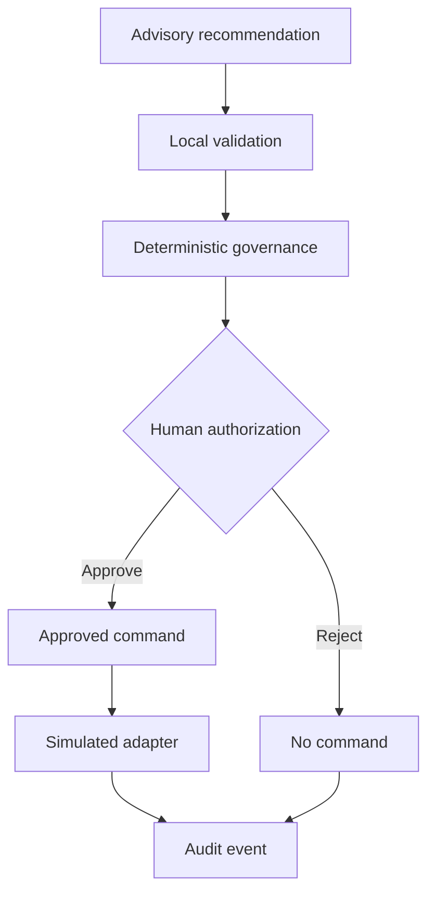
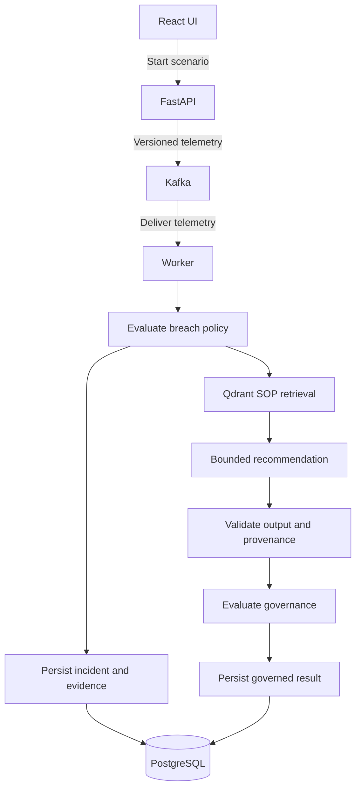
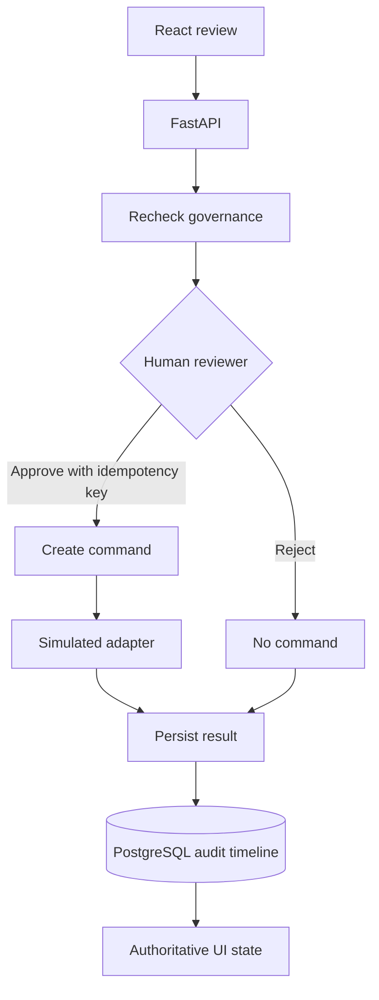

# ColdChain Sentinel architecture

This is the authoritative architecture for the current local portfolio system. Milestone documents remain historical implementation records.

## Purpose and trust model

ColdChain Sentinel detects temperature breaches and coordinates a governed response. It separates four concepts:

1. **AI recommendation** — untrusted, evidence-linked advice.
2. **Governance decision** — deterministic classification under versioned policy.
3. **Human authorization** — an accountable approve/reject decision.
4. **Operational command** — an idempotent instruction created only after authorization.

## End-to-end data flow

### Evidence and recommendation

The worker validates the telemetry contract before applying deterministic breach policy. It stores the reading, incident, and immutable evidence snapshot before retrieving effective SOP chunks. The provider returns advisory fields only; local code validates them, attaches trusted provenance, evaluates governance, and persists the result and audit events.

### Authorization and execution

FastAPI accepts the reviewer identity, rationale, and idempotency key. Rejection records the human decision without creating a command. Authorized approval creates one idempotent command, invokes only the simulated adapter, and persists the result and audit events before authoritative state is returned to the control tower.

## Components

### Telemetry and Kafka

The local demo publishes versioned synthetic telemetry to `coldchain.telemetry.v1`. The worker uses manual commit semantics, validates contracts, handles stale and duplicate readings, and uses `coldchain.telemetry.dlq.v1` for bounded failure envelopes. Kafka carries events; PostgreSQL is authoritative for workflow state.

### Breach detection and persistence

The worker applies a versioned deterministic temperature policy. PostgreSQL stores telemetry outcomes, incidents, evidence, recommendations, governance evaluations, approvals, commands, action results, and audit events. Alembic owns schema evolution.

### Evidence snapshots

An evidence snapshot freezes the readings, policy inputs, summary, timestamp, and content hash used for a recommendation. Later decisions reference the facts available at recommendation time rather than mutable UI state.

### SOP retrieval

Six authored ColdChain Sentinel SOP documents are chunked deterministically and indexed in Qdrant. Retrieval filters by effective and superseded dates. Chunk, document, and section identifiers are validated before model citations are accepted. The default embedding implementation is deterministic and network-free.

### Bounded recommendation

The provider-neutral boundary supports deterministic local output, Groq, and optional OpenAI. Live calls are disabled by default. An external model may choose only the recommended action, rationale, SOP and incident citations, contraindications, missing information, evidence sufficiency, and uncertainty.

Application code owns provider/model identity, schema and prompt versions, prompt hash, timestamps, latency, token usage, expiry, correlation ID, validation state, billing mode, and fallback state. Invalid JSON, schema drift, unknown citations, unsupported actions, timeouts, rate limits, provider errors, circuit-open state, or insufficient evidence select deterministic fallback.

### Governance and human authority

Deterministic governance independently classifies the proposed action. `HOLD_SHIPMENT` requires an authorized dispatcher. The kill switch takes precedence. The model cannot approve itself, alter policy, write directly to PostgreSQL, or create a command.

### Commands and simulated execution

Approval includes a stable idempotency key. Exact replays return the original outcome; conflicting reuse fails. Only an authorized approved recommendation can create a command. The current adapter simulates the shipment hold and records the result; it does not contact a carrier or warehouse.

### Audit timeline

Workflow events are append-only and hash-linked. The timeline records correlation, causation, actor, component and schema versions, payload, timestamp, prior hash, and event hash. This demonstrates tamper evidence but is not a substitute for production immutable storage.

### API and React control tower

FastAPI exposes health, demo, incident, decision, command, and metrics endpoints. The Nginx-served React application uses a same-origin `/api` proxy, strict Zod response validation, bounded timeouts, cancellation, and no mutation retries. API mode never silently substitutes fixture data.

### Observability

Metrics use bounded labels and exclude incident content. Structured logs allowlist fields and redact credential-shaped values. OpenTelemetry spans carry correlation context across HTTP and Kafka without recording prompts, SOP text, responses, credentials, or payloads. Prometheus, Grafana, and Jaeger are localhost-only optional services.

## Failure and safety behavior

| Failure | Safe behavior |
| --- | --- |
| Provider disabled, missing key, timeout, rejection, rate limit, or circuit open | Deterministic recommendation |
| Invalid output or citation | Reject provider output; deterministic fallback |
| Missing retrieval evidence | Fallback with insufficiency metadata |
| Expired recommendation | Governance blocks approval |
| Unauthorized identity | API rejects the decision |
| Duplicate decision | Idempotent original result |
| Conflicting idempotency reuse | HTTP 409; no second command |
| Kill switch active | No operational command |
| UI/API disconnect | Visible unavailable state; no fixture substitution |

## Local versus production

Local Compose binds ports to loopback and uses development credentials, plaintext internal Kafka, synthetic identities, simulated actions, and single-node services. Production requires managed identity and secrets, TLS, network isolation, data governance, real integrations, transactional delivery guarantees, capacity and chaos testing, backups, HA/DR, operational SLOs, provider cost controls, and deployment-specific regulatory validation.
